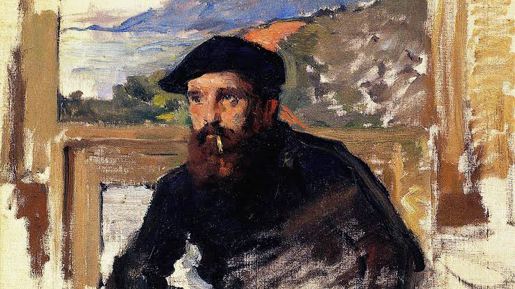

  

# Monet-style-paintings-kaggle

## Project Overview
This project demonstrates an incremental approach to transforming photographs into Monet-style paintings using CycleGAN. Developed as part of a Kaggle competition, the goal is to apply Monet's unique artistic style to a set of natural photos, achieving a visually compelling style transfer.

## Approach
The project builds up the CycleGAN model through a series of structured steps:

Exploratory Data Analysis (EDA): 

* Initial analysis of the dataset to understand the distribution and characteristics of both Monet paintings and natural photographs. This includes data loading, preprocessing, and visualization.

* Building the CycleGAN Architecture:

  * Generator: Responsible for transforming images from one style to another (e.g., from photo to Monet painting).
  * Discriminator: Trains to distinguish between real images and generated images within each domain, providing feedback to the generator to improve the realism of generated images.
    
* Training Process:

  * Cycle Consistency: Ensures that images maintain their core content when transformed back and forth between styles.
  * Loss Functions: Uses a combination of adversarial loss and cycle consistency loss to guide the model in producing stylistically accurate yet content-preserving images.
  * Model Optimization: Incrementally refines the generator and discriminator models through a series of training epochs, improving image fidelity with each iteration.

* Evaluation with MiFID: The model is evaluated using the Memorization-informed Fréchet Inception Distance (MiFID), a modified version of FID that assesses the quality of generated images. Lower MiFID scores indicate better adherence to the Monet style.

## Results and Future Improvements

* Model Performance: Detailed results, including MiFID scores and qualitative image samples, are presented in the final report.
* Future Work:
  * Experiment with more complex generator and discriminator architectures.
  * Incorporate advanced loss functions, such as perceptual or feature matching loss, to enhance the style transfer quality.
  * Investigate progressive training techniques to improve the model’s performance on high-resolution images.

## References

[I'm Something of a Painter Myself](https://www.kaggle.com/competitions/gan-getting-started/overview)
